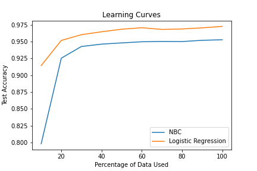
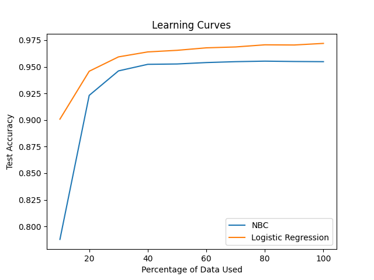

# ML
### Lab 2

**Handin 1**
*In the lectures, we only formulated the negative log-likelihood for Logistic Regression,without adding any regularization term. As per the formulation used in the lectures, if you wanted to add λwTw as a regularization to the negative log-likelihood of observing the data,and set λ= 0.1, what value of C would you set in the sklearn implementation?*

According to the [sklearn documentation](https://scikit-learn.org/stable/modules/generated/sklearn.linear_model.LogisticRegression.html#sklearn.linear_model.LogisticRegression):
> Cfloat, default=1.0
> ~ Inverse of regularization strength; must be a positive float. Like in support vector machines, smaller values specify stronger regularization.

so we would set `C=10` in the sklearn implementation.

**Handin 2**

Graphs of testing errors for LR and NBC:

*This graph was created using the default value of C=1 for logistic regression—this corresponds to λ=1.*

Test Accuracy represents the percentage of data points classified correctly when the models are run on the testing data (i.e. it is the number of correct classifications, divided by the total number of data points).

With C=10, so λ=0.1, the graph becomes:

As we can see, the NBC model reaches its asymptotic limit even more quickly than before.